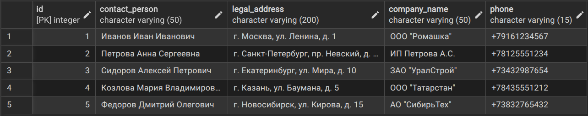
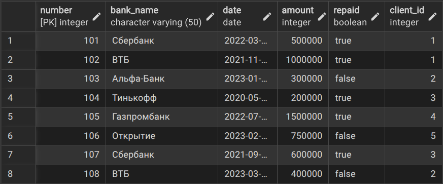
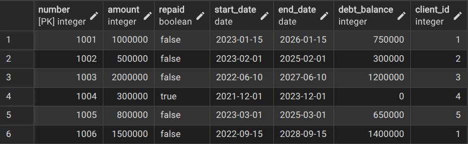
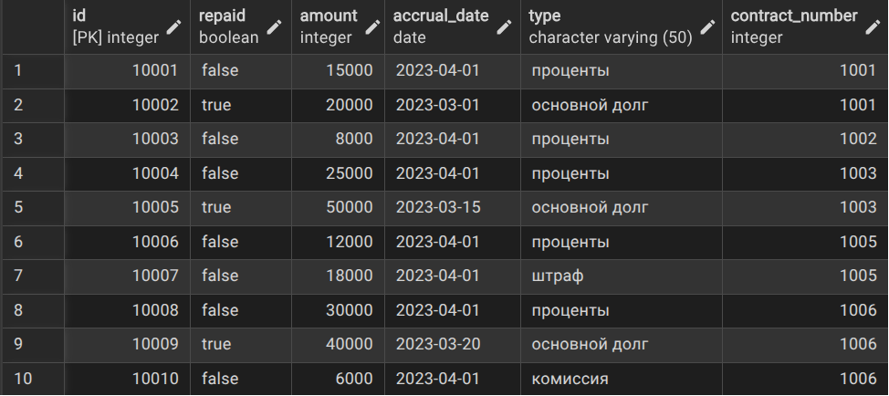
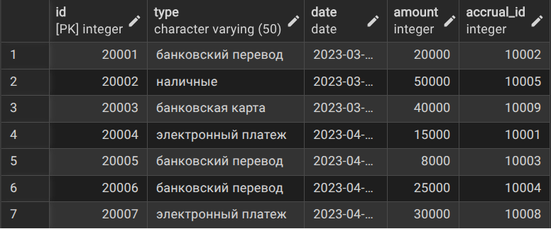
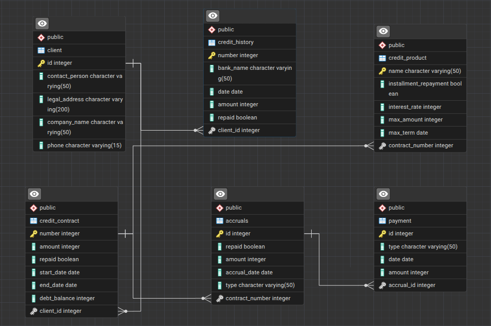

# Database Lab

Database Labs in YarSU, Andreev Stepan, PMI-32, Lab number 22.


## Lab 1

### ER-model:


### Relation-model:


## Lab 2 (PGSQL)

### SQL create tables:

```
CREATE TABLE Client (
    ID INT PRIMARY KEY,
    contact_person VARCHAR(50) NOT NULL,
    legal_address VARCHAR(200) NOT NULL,
    company_name VARCHAR(50) NOT NULL,
    phone VARCHAR(15)
);

CREATE TABLE Credit_History (
    number INT PRIMARY KEY,
    bank_name VARCHAR(50) NOT NULL,
    date DATE NOT NULL,
    amount INT CHECK (amount >= 0),
    repaid BOOLEAN,
    client_id INT NOT NULL,
    FOREIGN KEY (client_id) REFERENCES Client(ID) ON DELETE CASCADE
);

CREATE TABLE Credit_Contract (
    number INT PRIMARY KEY,
    amount INT CHECK (amount >= 0),
    repaid BOOLEAN,
    start_date DATE NOT NULL,
    end_date DATE CHECK (end_date IS NULL OR end_date >= start_date),
    debt_balance INT CHECK (debt_balance >= 0),
    client_id INT NOT NULL,
    FOREIGN KEY (client_id) REFERENCES Client(ID) ON DELETE RESTRICT
);

CREATE TABLE Credit_Product (
    name VARCHAR(50) PRIMARY KEY,
    installment_repayment BOOLEAN NOT NULL,
    interest_rate INT CHECK (interest_rate >= 0 AND interest_rate <= 100),
    max_amount INT CHECK (max_amount >= 0),
    max_term DATE NOT NULL,
    contract_number INT NOT NULL,
    FOREIGN KEY (contract_number) REFERENCES Credit_Contract(number) ON DELETE CASCADE
);

CREATE TABLE Accruals (
    ID INT PRIMARY KEY,
    repaid BOOLEAN NOT NULL,
    amount INT CHECK (amount >= 0),
    accrual_date DATE NOT NULL,
    type VARCHAR(50) NOT NULL,
    contract_number INT NOT NULL,
    FOREIGN KEY (contract_number) REFERENCES Credit_Contract(number) ON DELETE CASCADE
);

CREATE TABLE Payment (
    ID INT PRIMARY KEY,
    type VARCHAR(50) NOT NULL,
    date DATE,
    amount INT CHECK (amount >= 0),
    accrual_id INT NOT NULL,
    FOREIGN KEY (accrual_id) REFERENCES Accruals(ID) ON DELETE RESTRICT
);
```

## Client table:


## Credit History table:


## Credit Contract table:


## Credit Product table:


## Accruals table:


## Payment table:


## Diagram:


## Lab 4

### Процедура для формирования списка клиентов с просроченными кредитами
